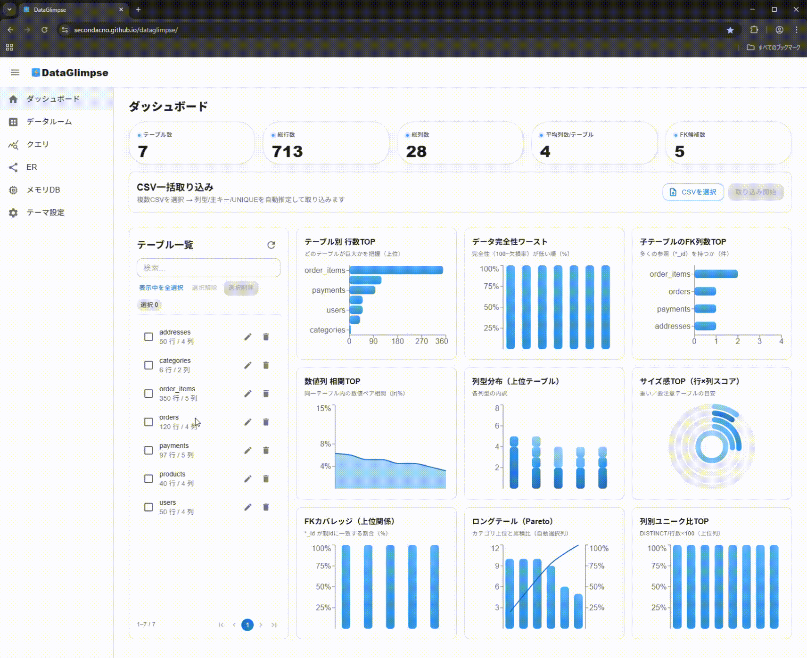

  

<h1 align="center">DataGlimpse</h1>

  ブラウザだけでデータ分析・ER 図作成を可能にする Next.js アプリ。 
   
  DuckDB-WASM / SQLite を用いて、クライアント完結のデータルームを実現。  
   
  取り込んだデータはすべてクライアント側に保持されるため、情報漏洩の心配はありません。

  <a href="#概要">概要</a> • 
  <a href="#使用方法">使用方法</a> •
  <a href="#技術スタック">技術スタック</a> • 
  <a href="#ディレクトリ構成">ディレクトリ構成</a> | 
  <a href="https://secondacno.github.io/dataglimpse/">Live</a> 

  

## 概要

- **インスタントデータルーム**  
  CSVをブラウザに取り込み、即座にSQL実行・ER図生成などを行えます。 
  また、Parquetファイルも扱うことができます。

- **実装**  
  - **Next.js (App Router) + TypeScript** で開発  
  - **DuckDB-WASM** を Worker + ESM で安全に利用  
  - **SQLite (sql.js)** を併用 → 軽量なクエリ実行も可能  
  - **MUI + Recharts + React Flow** による UI/グラフ/ER 表現   
  - **CSV → Parquet 変換**や**ER 自動簡易推定アルゴリズム**などを実装  

---

## 使用方法

- **アクセス**  
  https://secondacno.github.io/dataglimpse/

- **CSV 読み込み (SQLite 使用)**  
  ダッシュボード画面で、データが記述された CSV ファイルを読み込みます。

- **インメモリ DB / Parquet ファイル (DuckDB 使用)**  
  「インメモリDB」ページにて、CSV または Parquet ファイルを読み込みます。

- **セキュリティ**  
  読み込まれたデータはすべてクライアント側で保持・処理されるため、**情報漏洩の心配はありません。**

## 技術スタック

### Framework / Core
- **Next.js 15.4.6** （App Router）
- **React 19.1.0** / **React DOM 19.1.0**
- **TypeScript 5** 

### UI / アニメーション
- **MUI (Material UI) v7.3.1**
- **MUI Icons** 
- **Emotion** (`@emotion/react`, `@emotion/styled`)
- **Framer Motion**
- **React CountUp**

### エディタ / SQL 補完
- **CodeMirror 6**
  - `@uiw/react-codemirror`
  - `@codemirror/lang-sql`
  - `@codemirror/autocomplete`
- **sql-formatter**

### データ処理 / DB
- **DuckDB-WASM** (`@duckdb/duckdb-wasm`)
- **sql.js** （SQLite WASM 版）
- **PapaParse** （CSV パーサー）
- **@tanstack/react-virtual** （テーブルの仮想化）

### グラフ / 可視化
- **Recharts v3.1.2**
- **React Flow v11.11.4**
- **html-to-image**

### ファイル入出力
- **React Dropzone**

### 開発ツール
- **ESLint 9** / **eslint-config-next**
- **shx** （クロスプラットフォームシェルコマンド）
- **@types/** （各種型定義 – TypeScript 型補完）

---

## ディレクトリ構成
<pre>
src
+---app                   # Next.js App Router のエントリポイント
|   +---data              # データ関連ページ
|   +---er                # ER 図ページ
|   +---memory            # DuckDB in-browser メモリDBページ
|   +---query             # SQL クエリ実行ページ
|   \---theme             # テーマ設定ページ
+---components            # 共通 UI コンポーネント群
|   +---common            # ダイアログ/ボタン等の汎用部品
|   +---layout            # AppShell, Header, Sidebar などレイアウト
|   \---providers         # Context Provider / Theme Provider
+---features              # ドメイン単位の機能モジュール
|   +---dashboard         # ダッシュボード機能
|   |   +---components    # ダッシュボード専用UI
|   |   +---constants     # 定数定義
|   |   +---containers    # 状態管理 + ViewModel
|   |   +---hooks         # React Hooks
|   |   +---lib           # 内部ライブラリ
|   |   +---services      # ビジネスロジック
|   |   \---views         # プレゼンテーション(View)
|   +---data              # テーブル情報/プロファイリング
|   |   +---components    # UI
|   |   +---containers    # Containerコンポーネント
|   |   +---domain        # 型・エンティティ
|   |   +---hooks         # ViewModel hooks
|   |   +---repositories  # データアクセス層
|   |   +---services      # ドメインサービス
|   |   +---utils         # ヘルパー関数
|   |   \---views         # View層
|   +---er                # ER 図生成機能
|   |   +---components    # ER 専用UI
|   |   +---containers    # Container
|   |   +---domain        # 型・エンティティ
|   |   +---hooks         # ViewModel hooks
|   |   +---services      # ドメインサービス
|   |   +---state         # Zustand/Recoil 等の状態管理
|   |   +---utils         # ヘルパー
|   |   \---views         # View
|   +---memory            # DuckDB メモリDB機能
|   |   +---components    # UI
|   |   +---containers    # Container
|   |   +---hooks         # ViewModel hooks
|   |   +---types         # 型定義
|   |   +---utils         # ヘルパー
|   |   \---views         # View
|   +---query             # SQL クエリ実行機能
|   |   +---components    # UI
|   |   +---containers    # Container
|   |   +---hooks         # ViewModel hooks
|   |   +---services      # サービス層
|   |   +---utils         # ヘルパー
|   |   \---views         # View
|   \---theme             # UI テーマ切り替え機能
|       +---containers    # Container
|       +---domain        # 型・設定
|       \---views         # View
+---hooks                 # 全体共通のカスタムフック
\---lib                   # 外部ライブラリ接続や低レベル util
    \---sql               # SQLite 操作用ヘルパー

</pre>

